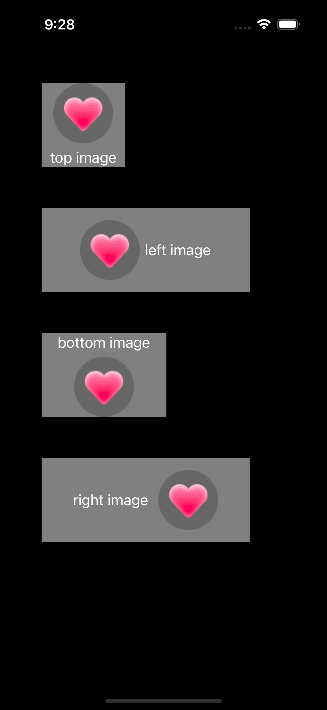

# MOOImageButton

[](https://travis-ci.org/994355869@qq.com/MOOImageButton)
[](https://cocoapods.org/pods/MOOImageButton)
[](https://cocoapods.org/pods/MOOImageButton)
[](https://cocoapods.org/pods/MOOImageButton)

## Example

To run the example project, clone the repo, and run `pod install` from the Example directory first.



## Installation

MOOImageButton is available through [CocoaPods](https://cocoapods.org). To install
it, simply add the following line to your Podfile:

```ruby
pod 'MOOImageButton', '0.1.0'
```
```ruby
pod install
```
```swift
import MOOImageButton

let button = MOOImageButton(imagePosition: .top, imgTitleMargin: 6.0)
button.setTitle("top image", for: .normal)
button.setImage(UIImage(named: "moo_like"), for: .normal)
button.frame = CGRect(x: 50.0, y: 100.0, width: 100.0, height: 100.0)
```

## Author

994355869@qq.com

## License

MOOImageButton is available under the MIT license. See the LICENSE file for more info.
